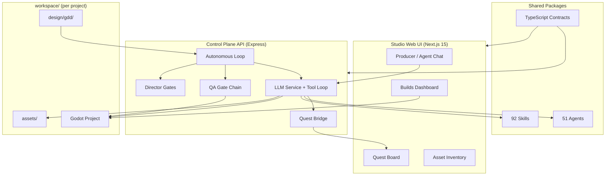

# Game Studio Control Plane

> **NO RULES. JUST CREATE.**

End-to-end AI-native game production — from a single prompt to a **playable, tested, exportable** Godot game. Not a demo chatbot: a **51-agent studio** with skills, director gates, Kanban quest tracking, autonomous loops, asset generation, and release pipelines.

---

## Table of Contents

- [Problem & Product Value](#problem--product-value)
- [What Ships Today](#what-ships-today)
- [Quick Start](#quick-start)
- [System Architecture](#system-architecture)
- [Engineering Quality](#engineering-quality)
- [Commercial Potential & Global Scale](#commercial-potential--global-scale)
- [Repository Map](#repository-map)
- [Development & CI](#development--ci)

---

## Problem & Product Value

**Single-agent coding assistants fail at game production.** Games need parallel specialists (design, code, art, audio, QA, release), long-running context, verifiable output, and milestone governance — not one thread that forgets yesterday.

**Game Studio Control Plane** is a **Board Room orchestrator** for game studios:

| Pain | Our answer |
|------|------------|
| Agents work in isolation | **3-tier hierarchy** — directors delegate to 39 specialists with explicit `reportsTo` and delegation maps |
| Prompts drift; no accountability | **Quest Bridge** — every `Task` spawn creates a Kanban ticket; auto-verification on QA column |
| “It compiles” ≠ shippable | **Executable QA** — Godot boot → GUT → smoke → regression baseline before tickets complete |
| Ideas never become builds | **Autonomous loop** — GDD ingest → ticket generation → implement → verify → milestone gates → export |
| No visibility for humans | **Studio Web UI** — live WebSocket feed, agent tree, context bar, builds dashboard, wiki graph |

**Authenticity:** The platform drives real files in `workspace/` — `.gd` scripts, `.tscn` scenes, GDD markdown, generated PNG/WAV assets, and Godot export artifacts. You can clone, run, and inspect output.

---

## What Ships Today

Feature completeness for evaluators — each item maps to runnable code:

| Capability | Status | Entry points |
|------------|--------|--------------|
| Multi-agent orchestration (LLM + tools) | ✅ | `apps/api/src/services/llm-service.ts` |
| 51 agents, 92 skills (validated registries) | ✅ | `packages/agents/`, `packages/skills/` |
| Producer chat + slash commands | ✅ | `apps/web/src/app/(studio)/chat/` |
| Autonomous production loop | ✅ | `apps/api/src/routes/autonomous.ts` |
| GDD → Kanban ticket ingest | ✅ | `apps/api/src/services/gdd-ingest-service.ts` |
| Genre-aware ticket generator (platformer, RPG, racing, …) | ✅ | `apps/api/src/services/ticket-generator.ts` |
| 18 LLM director gates | ✅ | `apps/api/src/services/gate-service.ts`, `milestone-gate-service.ts` |
| 12 team workflows (combat, release, multiplayer, …) | ✅ | `packages/skills/src/team-skills.ts` |
| Godot MCP Pro integration (169 tools, lite mode) | ✅ | `apps/api/src/services/godot-mcp-service.ts` |
| AI asset pipeline (FLUX → rembg → Godot `.import`) | ✅ | `scripts/asset-pipeline/asset-pipeline.py` |
| Build registry + export + smoke | ✅ | `apps/api/src/services/build-service.ts`, `/builds` UI |
| Session compaction + context management | ✅ | `apps/api/src/routes/chat.ts` |
| GitHub Actions CI (typecheck, test, Playwright) | ✅ | `.github/workflows/ci.yml` |

**Supported engine today:** Godot 4 is production-ready.

---

## Quick Start

### Prerequisites

- **Node.js 20+**, **pnpm 10+**
- **Z.ai API key** — copy [`.env.example`](.env.example) → `.env`

```bash
pnpm install
cp .env.example .env   # set ZAI_API_KEY + API_SECRET (≥16 chars)

pnpm generate          # validate 51 agents + 92 skills
pnpm typecheck

# API → http://localhost:3001
pnpm --filter @game-studio/api dev

# Web → http://localhost:3000  (separate terminal)
pnpm --filter @game-studio/web dev
```

### 5-minute demo path

1. **Dashboard** — create a Godot project  
2. **Comms** — tell the Producer: *“Build a 2D platformer with coins and patrol enemies”*  
3. **Quests** — watch tickets move Available → Processing → Verify → Archived  
4. **Autonomous** — start the loop for hands-off production (optional)  
5. **Builds** — export and inspect smoke-test status  

Extended setup (Godot MCP, FLUX assets, ShipThis CLI): [CLAUDE.md](CLAUDE.md)

---

## System Architecture



### Autonomous production pipeline

```
User prompt
  → GDD ingest + genre-aware tickets
  → assign agent per ticket area
  → LLM tool loop (Read/Write/Task/GenerateAsset/…)
  → boot + GUT + smoke + regression QA
  → LLM verifier (code-reviewer, qa-tester, …)
  → milestone director gates (CD / TD / Producer / QA / Art)
  → changelog + Godot export
```

### Agent & skill model

| Tier | Model | Roles | Purpose |
|------|-------|-------|---------|
| 1 | glm-5.1 | Producer, creative-director, technical-director, autonomous-producer | Orchestration & gates |
| 2 | glm-4.7 | game-designer, lead-programmer, art-director, qa-lead, … | Department leads |
| 3 | glm-4.7 | godot-specialist, gameplay-programmer, code-reviewer, … | Implementation |

Skills are **multi-phase workflows** with optional `subSkills` cascade (e.g. `implement-level` → tilemap + enemy + HUD). Team skills coordinate 4–6 agents in parallel phases.

---

## Engineering Quality

Structured for **automated repo evaluation** — typed monorepo, validated registries, CI, and clear boundaries.

### Monorepo layout (Turbo + pnpm)

| Package | Role |
|---------|------|
| `@game-studio/types` | Single source of truth for agents, skills, tickets, WebSocket events |
| `@game-studio/agents` | 51 agent defs + tier mapping + delegation graph |
| `@game-studio/skills` | 92 skills incl. 13 Godot production skills + 12 team workflows |
| `@game-studio/api` | Express API, LLM orchestration, autonomous loop, MCP bridge |
| `@game-studio/web` | Next.js 15 App Router studio UI |
| `@game-studio/state` | File-based session persistence |

### Quality gates in repo

```bash
pnpm generate    # fails CI if agent/skill registry invalid
pnpm typecheck   # strict TS across 7 packages
pnpm test        # API unit tests
pnpm --filter @game-studio/web test:e2e   # Playwright (chat, dashboard, consultation)
```

- **CI:** `.github/workflows/ci.yml` — install → generate → typecheck → test → E2E  
- **Auth:** timing-safe API key middleware; secrets via env only (see `.env.example`)  
- **Reliability:** per-file mutex on board writes, loop detection, session compaction, zombie loop recovery  
- **Observability:** structured Pino logs, WebSocket event stream, run metrics (`autonomous:metrics`)

### Design decisions (authenticity signals)

- **Tool execution on backend** — LLM never pretends to run tools; `callLLMWithTools()` executes Read/Write/Bash/Task and returns results  
- **Quest Bridge** — agent work is traceable on Kanban, not hidden in chat logs  
- **Executable QA** — tickets require Godot boot/GUT/smoke evidence, not self-reported “done”  
- **Director gates** — LLM reviewers with parsed PASS/BLOCKED verdicts at milestones  

Full architecture reference: [CLAUDE.md](CLAUDE.md)

---

## Commercial Potential & Global Scale

### Who pays & why

| Segment | Use case | Monetization angle |
|---------|----------|-------------------|
| **Indie studios** | 1–10 person teams shipping Godot/mobile games | Seat-based studio license + credit pool for LLM runs |
| **AI-native creators** | Prompt-to-playable without hiring specialists | Usage-based credits (already modeled in settings ledger UI) |
| **Education / jams** | Teach production workflow with visible agent hierarchy | Institutional tier + sandbox projects |
| **Enterprise** | Custom agent/skills packs per franchise or engine | On-prem control plane + private model routing |

The **credit ledger**, **webhook notifications**, and **multi-project dashboard** are first-class UI — not roadmap slides.

### Global scalability

- **Language-agnostic orchestration** — agents/skills are data-driven MD + TypeScript registries; swap `ZAI_API_KEY` / `KIMI_API_KEY` for regional LLM providers  
- **Multi-engine agent defs** — Godot (production), Unreal, Unity, Phaser, Three.js specialists ready for expansion  
- **Localization skill + tickets** — `localize` workflow, translation CSV pipeline in ticket templates  
- **Cloud release path** — ShipThis CLI integration for Android/iOS export (`team-release` → build + smoke)  
- **Headless CI-friendly** — Godot headless boot/export scripts; no editor required for QA gate chain  

### Competitive positioning

| | Copilot / Cursor | Game Studio Control Plane |
|--|------------------|---------------------------|
| Unit of work | File / chat turn | **Quest ticket + milestone** |
| Team model | Single assistant | **51-role studio hierarchy** |
| Verification | User runs tests | **Automated QA + AI verifier + director gates** |
| Output | Code snippets | **Playable game + assets + export artifact** |

---

## Repository Map

```
game-control-plane/
├── apps/
│   ├── api/                 # Orchestration backend
│   │   ├── src/routes/      # REST + autonomous + builds + chat
│   │   ├── src/services/    # LLM, QA, gates, quest-bridge, MCP
│   │   └── src/llm/         # Z.ai client, tool loop, retries
│   └── web/                 # Studio UI (dashboard, chat, quests, assets, builds, wiki)
├── packages/
│   ├── agents/              # Agent registry (51)
│   ├── skills/              # Skill + team-skill registry (92)
│   ├── types/               # Shared interfaces
│   ├── config/              # Zod schemas, GDD/ADR templates
│   └── state/               # Session store
├── scripts/asset-pipeline/  # Local AI asset generation (FLUX, rembg)
├── workspace/               # Game output (gitignored; GDD, Godot projects, assets)
└── .github/workflows/ci.yml
```

---

## Development & CI

```bash
pnpm install
pnpm generate && pnpm typecheck && pnpm test
```

| Variable | Purpose |
|----------|---------|
| `ZAI_API_KEY` | LLM provider (required) |
| `API_SECRET` | API + WebSocket auth (≥16 chars) |
| `WORKSPACE_DIR` | Game development root (default `./workspace`) |
| `NEXT_PUBLIC_API_KEY` | Frontend → API key (dev only; exposed in browser) |

Never commit `.env`. See [`.env.example`](.env.example).

---

## License

See repository license. Vendored tools (`cli-main/`, `godot-mcp-pro-v1.11.0/`) retain their own licenses.

---
