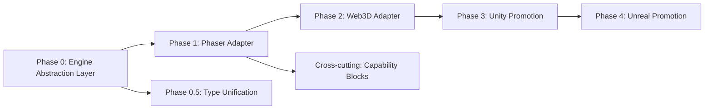

# Requirements: Multi-Engine Game Development AI Studio

> **Objective:** Transform Game Studio Control Plane from a **Godot-only** production platform into a **comprehensive Game Development AI Studio** supporting multiple engines — native (Godot, Unity, Unreal), web-native (Phaser, Three.js/Babylon.js), and emerging (Bevy, PlayCanvas) — with a unified, engine-agnostic production pipeline.

**Status:** Draft v1 — 2026-07-08
**Author:** Research synthesis from codebase audit + web research

---

## 1. Current State Audit

### 1.1 What Works (Godot — Production-Ready)

| Layer | Implementation | File |
|-------|---------------|------|
| Agents (6) | godot-specialist, godot-scaffolder, gdscript/csharp/shader/gdextension specialists | `packages/agents/src/engine-godot.ts` |
| Skills (13) | setup-godot-project → compose-scene → implement-player/enemy/level/hud → automated-playtest → export | `packages/skills/src/skills-by-phase.ts` |
| Tool: GodotCLI | init/detect/build/check/test/validate/export-presets/package | `apps/api/src/llm/zai-client.ts:1567` |
| Tool: RunGodotHeadless | check/script/export/gut commands | `apps/api/src/llm/zai-client.ts:1446` |
| MCP Pro Integration | 169 tools via JSON-RPC child process, project-keyed singleton, auto-setup | `apps/api/src/services/godot-mcp-service.ts` |
| Build/Export | `executeGodotExport` — headless export via Python runner | `apps/api/src/services/build-service.ts:106` |
| QA Gate Chain | boot → GUT → smoke → regression | `apps/api/src/services/qa-gate-service.ts` |
| Tool Injection | `project.engine === "godot"` → inject MCP tools + instructions | `apps/api/src/services/llm-service.ts:204` |

### 1.2 What's Broken / Incomplete

| Problem | Evidence |
|---------|----------|
| **Phaser/Three.js declared but empty** | `ProjectEngine` type includes `"phaser" \| "threejs"` (`packages/types/src/dashboard.ts:1`) but zero agents, skills, tools, or pipeline code |
| **Unity/Unreal are stubs** | 9 agents marked `experimental: true` with no skills, no tools, no MCP, no build pipeline |
| **Settings type inconsistency** | `GameEngine = "Unity" \| "Unreal" \| "Godot"` (`settings.ts`) ≠ `ProjectEngine = "unity" \| "unreal" \| "godot" \| "phaser" \| "threejs"` (`dashboard.ts`) |
| **GDD ingest hardcodes Godot** | Every engineering area maps to `godot-specialist` (`gdd-ingest-service.ts:27-38`) — Unity/Phaser projects would assign the wrong specialist |
| **Autonomous loop Godot-only** | Starts Godot MCP only for `engine === "godot"` (`autonomous.ts:1683`) — other engines get no tool bridge |
| **Build service Godot-only** | `executeGodotExport` is the only export path; pipeline skills call it unconditionally for release |
| **Research/GDD prompts assume Godot** | Deep research says "this project uses Godot Engine 4.x as primary" (`deep-research-service.ts:60`) regardless of selected engine |

---

## 2. Target Engine Matrix

Research-grounded selection. Each engine needs a full vertical slice: **agents → skills → tools → QA → build → export → deploy**.

| Engine | Category | Why Include | Research Source |
|--------|----------|-------------|-----------------|
| **Godot 4** | Native 2D/3D | Already production-ready — keep as reference implementation | Existing codebase |
| **Unity** | Native 2D/3D | Largest market share, C#, DOTS/ECS, URP/HDRP. 5 experimental agents exist | [Cinevva 2026 comparison](https://app.cinevva.com/blog/2026-06-09-web-game-engines-2026-comparison) |
| **Unreal 5** | Native AAA 3D | Nanite/Lumen, GAS, Blueprint/C++. 4 experimental agents exist | BlueprintForge targets UE5+Unity |
| **Phaser 3** | Web 2D | #1 HTML5 2D engine; Phaser Studio built their own "Phaser Game Agent" with Claude + Superserve sandboxes (June 2026) | [Phaser Game Agent article](https://phaser.io/news/2026/06/how-we-built-the-phaser-game-agent-with-claude-managed-agents-and-superserve) |
| **Three.js** | Web 3D (rendering lib) | Most widely used web 3D library, MIT, maximum control | [Babylon vs Three.js comparison](https://dev.to/devin-rosario/babylonjs-vs-threejs-the-360deg-technical-comparison-for-production-workloads-2fn6) |
| **Babylon.js** | Web 3D (full engine) | Batteries-included: Havok physics, free web editor, Microsoft-backed. Better than Three.js for "complete engine" out-of-box | [Cinevva comparison](https://app.cinevva.com/blog/2026-06-09-web-game-engines-2026-comparison) |
| **Bevy** | Rust ECS | Emerging, WebAssembly-compilable, modern ECS. Good for systems-heavy games | [Bevy GitHub](https://github.com/bevyengine/bevy) |
| **PlayCanvas** | Web 3D (hosted) | Unity-like web editor, MIT engine, ECS, best Gaussian splatting tooling | [PlayCanvas](https://playcanvas.com/) |

**Phase 1 priority** (based on AI-agent friendliness + existing investment): Godot (done) → **Phaser** → **Three.js/Babylon.js** → Unity → Unreal → Bevy/PlayCanvas

---

## 3. Key Design Insight from Research

### The Phaser Studio Lesson (critical for AI studios)

Phaser Studio rebuilt their engine **from scratch for an AI audience** ("Phaser AE — Arcade Engine"). The core insight:

> *"The API maps to how an agent thinks about what it's doing, not how a renderer thinks about what it's drawing."*

**Actionable patterns for our studio:**

1. **Game manifests over raw code** — decompose target games into capability blocks (`actor.avatar.flight`, not "Gradius ship"). Agents compose known-correct blocks; the library compounds.
2. **Small, consistent API surface** — too many functions degrade agent quality (hallucinated lookalikes). One consistent idiom per engine.
3. **Docs as API** — documentation is what the model reads. Must be injected into context, not left as external links.
4. **Headless acceptance tests** — automated checks gate mechanics; human play catches feel/design issues automated checks miss.
5. **Procedural art fallback** — canvas-primitive sprites + synthesized SFX + chiptune when AI asset generation unavailable.
6. **Sandboxed build environments** — isolated VM with prebuilt engine, project scaffold, toolchain. Zero setup; every token goes on the game.

**Implication:** Our engine adapters must expose tools with **verb/intention-level naming**, not low-level renderer calls.

---

## 4. Feature Requirements

### FR-1: Engine Abstraction Layer (Foundation)

**Problem:** Every engine path is hardcoded to Godot. No way to plug in a new engine without forking the pipeline.

| Requirement | Description |
|-------------|-------------|
| FR-1.1 Engine Adapter Interface | Define `EngineAdapter` interface: `scaffold()`, `getTools()`, `getInstructions()`, `validateBuild()`, `export()`, `runTests()`, `getQAChain()` |
| FR-1.2 Adapter Registry | `Map<ProjectEngine, EngineAdapter>` — one registration point. Replace scattered `if (engine === "godot")` checks with `adapter = getEngineAdapter(project.engine)` |
| FR-1.3 Migrate Godot as reference | Extract existing Godot code into `GodotEngineAdapter` implementing the interface — proves the abstraction is real, not aspirational |
| FR-1.4 Engine-aware GDD routing | `gdd-ingest-service.ts` must resolve specialist by engine, not hardcode `godot-specialist` |
| FR-1.5 Engine-aware autonomous loop | Autonomous producer delegates to engine-specific scaffolder + specialist via adapter |
| FR-1.6 Engine-aware build service | `executeExport(projectId, platform)` dispatches to adapter — not `executeGodotExport` |

**Files affected:** `gdd-ingest-service.ts`, `autonomous.ts`, `build-service.ts`, `llm-service.ts`, `settings.ts`, `dashboard.ts`

---

### FR-2: Phaser Engine Adapter (Web 2D)

**Why first after Godot:** Phaser Studio proved AI-agent viability; #1 web 2D engine; runs in-browser (zero install barrier); TypeScript-native (matches our stack).

| Requirement | Description |
|-------------|-------------|
| FR-2.1 Phaser agents | `phaser-specialist` (tier 3), `phaser-scaffolder` (tier 3), `phaser-typescript-specialist` |
| FR-2.2 Phaser skills | `setup-phaser-project` (Vite + TS + Phaser), `implement-phaser-scene`, `implement-phaser-physics` (Arcade/Matter.js), `implement-phaser-tilemap`, `automated-phaser-playtest` |
| FR-2.3 PhaserCLI tool | `init` (scaffold Vite project), `dev` (start vite dev server), `build` (vite build → dist/), `test` (Vitest + jsdom headless), `preview` (static server) |
| FR-2.4 Headless test runner | Phaser supports HEADLESS renderer mode + Vitest + jsdom (DeepWiki confirmed). Tool: `RunPhaserHeadless` — boots Phaser.Game in headless mode, runs scene tests |
| FR-2.5 Capability-block library | Following Phaser Studio's pattern: `phaser-blocks/` with reusable, configurable components (player controller, enemy AI, HUD) named by capability, not game |
| FR-2.6 Web deploy target | Static build → deploy to Vercel/Netlify/Cloudflare Pages. Build service needs `executeWebExport` (vite build + deploy) |
| FR-2.7 In-browser live preview | Since Phaser runs in browser, add live preview iframe in studio UI (unlike Godot which needs editor) |

**Research grounding:** Phaser testing uses Vitest + jsdom with HEADLESS renderer mode ([DeepWiki](https://deepwiki.com/phaserjs/phaser/12.3-testing)); can run server-side ([phaser-on-nodejs](https://github.com/geckosio/phaser-on-nodejs), [phaser-headless](https://github.com/mikewesthad/phaser-headless)).

---

### FR-3: Three.js / Babylon.js Adapter (Web 3D)

| Requirement | Description |
|-------------|-------------|
| FR-3.1 Web3D agents | `threejs-specialist`, `babylon-specialist` — distinguish because Three.js is a rendering lib (BYO physics/entity systems) vs Babylon.js is a full engine (Havok built-in, web editor) |
| FR-3.2 Web3D skills | `setup-web3d-project` (Vite + Three.js OR Babylon.js), `implement-3d-scene`, `implement-3d-physics` (Rapier/Cannon for Three.js; Havok for Babylon.js), `implement-3d-camera` |
| FR-3.3 Web3DCLI tool | init/dev/build/test/preview — same shape as PhaserCLI |
| FR-3.4 Headless WebGL testing | Mock WebGL context (headless-gl / jsdom canvas mock); integration tests for scene graphs |
| FR-3.5 GLTF asset pipeline | Extend asset pipeline to output GLB (not just PNG) for 3D; integrate Draco compression + KTX2 textures |
| FR-3.6 3D asset generation | Add 3D model generation (text-to-3D) alongside existing 2D FLUX pipeline |
| FR-3.7 WebGPU readiness | Both engines support WebGPU growingly; flag WebGPU features in project config |

---

### FR-4: Unity Engine Adapter (Native — promote from experimental)

| Requirement | Description |
|-------------|-------------|
| FR-4.1 Unify agents from experimental | Remove `experimental: true` from 5 Unity agents once skills/tools exist |
| FR-4.2 Unity skills | `setup-unity-project`, `implement-unity-mono`, `implement-unity-dots`, `implement-unity-urp`, `automated-unity-playtest` (Unity Test Framework) |
| FR-4.3 Unity tool bridge | CLI: `unity-cli` (create project, run tests via Unity Test Runner, build via `-batchmode`). No MCP available (Unity has no open MCP standard) — file I/O + CLI |
| FR-4.4 Unity build/export | `executeUnityExport` — Unity batchmode build for Windows/Mac/WebGL/Android/iOS |

---

### FR-5: Unreal Engine Adapter (Native — promote from experimental)

| Requirement | Description |
|-------------|-------------|
| FR-5.1 Unreal skills | `setup-unreal-project`, `implement-unreal-blueprint`, `implement-unreal-gas`, `automated-unreal-playtest` (Unreal Automation System) |
| FR-5.2 Unreal tool bridge | UBT (UnrealBuildTool) CLI, UAT (Unreal Automation Tool) for builds/tests |
| FR-5.3 Unreal build/export | Packaging via UAT |

---

### FR-6: Engine Selection & Onboarding UX

| Requirement | Description |
|-------------|-------------|
| FR-6.1 Unified engine type | Single `ProjectEngine` union across all packages: `godot \| unity \| unreal \| phaser \| threejs \| babylon \| bevy \| playcanvas`. Fix `settings.ts` ↔ `dashboard.ts` split |
| FR-6.2 Engine picker at project creation | Dashboard shows engine cards with: name, 2D/3D capability, web-native badge, difficulty, "AI-friendly" rating |
| FR-6.3 Engine recommendation | Based on GDD concept (2D platformer → Phaser/Godot; 3D shooter → Unity/Unreal/Babylon; browser-first → Phaser/Three.js/Babylon) |
| FR-6.4 Engine health dashboard | Per-engine status: CLI installed? MCP available? Templates downloaded? |

---

### FR-7: Capability-Block Component Library

**Inspired by Phaser Studio's game manifest + block architecture.** This is the compounding-asset differentiator.

| Requirement | Description |
|-------------|-------------|
| FR-7.1 Block registry | `packages/blocks/` — engine-agnostic capability blocks: `player-controller-2d`, `enemy-ai-patrol`, `hud-health-bar`, `save-system-json`, etc. |
| FR-7.2 Block → engine implementation | Each block has per-engine implementations: `player-controller-2d/godot.gd`, `player-controller-2d/phaser.ts`, `player-controller-2d/unity.cs` |
| FR-7.3 Block search tool | `SearchBlocks(capability, engine)` — agents find reusable components instead of writing from scratch |
| FR-7.4 Block harvesting loop | After a game ships, extract reusable pieces → publish as blocks (the Phaser Studio harvest pattern) |
| FR-7.5 Game manifest format | JSON decomposition of a target game into required capabilities — agent composes from blocks + writes only glue code |

---

### FR-8: Cross-Engine Production Pipeline

| Requirement | Description |
|-------------|-------------|
| FR-8.1 Engine-aware ticket generation | `ticket-generator.ts` must produce engine-appropriate tickets (Phaser project ≠ Godot project scaffolding) |
| FR-8.2 Engine-aware QA gate chain | Godot: boot/GUT/smoke. Phaser: Vitest headless. Unity: Test Runner. Each adapter defines its QA chain |
| FR-8.3 Engine-aware deep research | Remove hardcoded "this project uses Godot" from research prompts; use actual project engine |
| FR-8.4 Multi-platform export matrix | Web engines → static hosting. Native → desktop/mobile binaries. Track per-engine export capabilities |

---

### FR-9: Live Preview & Deployment

| Requirement | Description |
|-------------|-------------|
| FR-9.1 Web game live preview | For Phaser/Three.js/Babylon: embedded iframe preview in studio UI (instant feedback, no editor needed) |
| FR-9.2 One-click deploy | Web games → Vercel/Netlify/Cloudflare Pages/GitHub Pages. Native → artifact download |
| FR-9.3 Playable URL sharing | Each web build gets a shareable URL (like Phaser Studio's "there's a URL you can play") |
| FR-9.4 Build registry extension | `builds.json` already tracks Godot exports — extend with `engine` + `deployUrl` fields |

---

### FR-10: Engine-Specific MCP Integrations

| Requirement | Description |
|-------------|-------------|
| FR-10.1 MCP adapter pattern | Generalize `GodotMCPService` into `MCPLifecycleManager` — same JSON-RPC-over-stdio pattern, different server binaries |
| FR-10.2 Unity MCP (if available) | Research Unity MCP ecosystem; if none, file I/O + CLI fallback |
| FR-10.3 Web dev server MCP | For web engines, a Vite dev server lifecycle manager (start/stop/HMR status) |

---

## 5. Implementation Phasing

### Phase 0 — Foundation (blocks everything)
- FR-1 (Engine Abstraction Layer)
- FR-6.1 (type unification)
- Extract Godot as reference adapter

### Phase 1 — Phaser (highest AI-agent ROI)
- FR-2 (Phaser adapter: agents, skills, tools, QA, build)
- FR-9.1 (web live preview)

### Phase 2 — Web 3D
- FR-3 (Three.js/Babylon adapter)

### Phase 3 — Unity promotion
- FR-4 (remove experimental, add skills/tools)

### Phase 4 — Unreal promotion
- FR-5

### Cross-cutting (parallel)
- FR-7 (capability blocks — starts empty, compounds over time)
- FR-8 (cross-engine pipeline fixes)

---

## 6. Non-Functional Requirements

| NFR | Requirement |
|-----|-------------|
| NFR-1 Zero Godot regression | The abstraction layer must not break the working Godot pipeline. All existing Godot tests must pass. |
| NFR-2 Type safety | `ProjectEngine` union is exhaustive. Adding an engine = one type change + one adapter. |
| NFR-3 Consistent tool naming | All engine CLIs follow `{Engine}CLI(command, ...)` shape. All headless runners follow `Run{Engine}Headless(...)`. |
| NFR-4 Isolated engine dependencies | Phaser/Vite deps must not pollute the API package. Use workspace project isolation. |
| NFR-5 Graceful degradation | If an engine CLI isn't installed, clear error message (like existing Godot "editor not running" handling). |

---

## 7. Research Sources

1. **Phaser Game Agent** — Phaser Studio's own Claude + Superserve implementation (June 2026): https://phaser.io/news/2026/06/how-we-built-the-phaser-game-agent-with-claude-managed-agents-and-superserve
2. **Phaser Testing** — Vitest + jsdom + HEADLESS renderer: https://deepwiki.com/phaserjs/phaser/12.3-testing
3. **Web Game Engines 2026** — PlayCanvas vs Three.js vs Babylon.js vs Unity WebGL: https://app.cinevva.com/blog/2026-06-09-web-game-engines-2026-comparison
4. **Babylon.js vs Three.js** — Production workload comparison: https://dev.to/devin-rosario/babylonjs-vs-threejs-the-360deg-technical-comparison-for-production-workloads-2fn6
5. **Best HTML5 Game Frameworks 2025**: https://generalistprogrammer.com/tutorials/best-html5-game-frameworks-2025
6. **Bevy Engine**: https://github.com/bevyengine/bevy
7. **PlayCanvas**: https://playcanvas.com/
8. **AI Game Studio landscape**: BlueprintForge (UE5/Unity), SEELE AI, LevelForge, Sorceress, AIGAMES

---

## 8. Open Questions

| # | Question | Default Decision |
|---|----------|-----------------|
| Q1 | Include Babylon.js as separate adapter or unify with Three.js? | Separate — different APIs, different tooling, different agent expertise |
| Q2 | Bevy/PlayCanvas in v1 or defer? | Defer to Phase 5+ — lower market demand, higher implementation cost |
| Q3 | Build a real "Phaser AE"-style engine, or use stock Phaser 3? | Stock Phaser 3 — building a custom engine is out of scope; use capability blocks to get the "small API surface" benefit |
| Q4 | MCP for non-Godot engines? | Only where ecosystem MCP exists (research needed per engine). File I/O + CLI is the universal fallback. |
| Q5 | 3D asset generation (text-to-3D) — which model? | Research needed: Shap-E, TripoSR, Meshy, CSM. Separate spike. |
